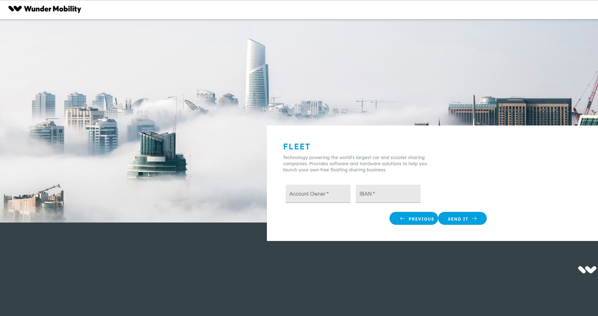

# **Wunder Form**
**Project Wunder Form** is an basic SPA (Single Page Appilication) to a user registration, like typically known from similar projects. The registration process contains 4 separated steps. Only one step is shown at a time to the customer.

## Demo

> [Check it live](https://test-b173f.firebaseapp.com/).

### View 1: Insert personal information
- Firstname, lastname, telephone

### View 2: Insert address information
- Address including street, house number, zip code, city

### View 3: Insert payment information
- Account owner
- IBAN (doesn’t need to be validated)
- When clicking the “next” button, the inserted data will be saved locally in the
browser storage and the payment data will be posted to an external
“demo-payment”.

### View 4: Success page
- Success message, when data are successful saved
- Show the “paymentDataId”, returned by demo endpoint

## **Table of contents**
- [**wunder**](#wunder-fleet)
  - [**Table of contents**](#table-of-contents)
  - [**How to install**](#how-to-install-using-ubuntu)
  - [**How to run**](#How-to-general-run)
  - [**How it works**](#how-it-works)
    - [**Main Page**](#main-page)
    - [**Dashboard**](#dashboard)
    - [**Details Page**](#details-page)
  - [**Features**](#features)
  - [**Built with**](#built-with)
  - [**Contributing**](#contributing)
  - [**Authors**](#authors)
  - [**License**](#license)
  - [**Contact me**](#contact-me)
 

## **How to install using Ubuntu**
To clone and run this application, you'll need [Git](https://git-scm.com/) and [Node.js](https://nodejs.org/en/download/) (which comes with [npm](http://npmjs.com/)) installed on your computer. After have them installed, from your terminal run:

```bash
# Clone this repository
$ git clone https://github.com/dwolopes/wunderform

# Go into the repository and install the application dependencies
$ cd wunder-form
$ npm install
$ npm start
```
** You can use ```Yarn``` as well.

> [Dowload Node.Js and NPM](https://nodejs.org/en/download/).

[(Back to top)](#wunder-fleet)

## **How to genetal run*

This project was bootstrapped with [Create React App](https://github.com/facebook/create-react-app).

### `npm start`

Runs the app in the development mode, after install all the dependecies.<br>
Open [http://localhost:3000](http://localhost:3000) to view it in the browser.

The page will reload if you make edits.<br>
You will also see any lint errors in the console.

[(Back to top)](#wunder-fleet)


## **How it works**

## **Features**
As the project has a lot of potencial to grow in features, I decided to add some new features beyond the default features that are demanded by the project specification.
- **React and Redux**: React probably is the most powerfull and known JS framework. I have been working with that for almost 1 year, which makes even easier for me to accomplish this project. It give us the possibility of build apps faster, enjoying awesomes features of JS and turning our app safer and featured with high tech design to the frontend side.
- **Redux**: Controlling user data from the form and it provides just one source of truth related do information. 
- **Typescript**: Using this feature is a way to prevent some basic erros. Besides that it gives de the possibility of apply better design patterns and guaratee and test better our application.
- **Validation**: Added some validation to prevent future problems caused by the absence od date in the database related to the user.
- **Acessibility**: It is possible to user and be guid correctly with screen readers. Labels are applied in images and inputs in the form.
- **Responsive Web Design**: Our app is fully responsible to mobile screens and tablets.

***All improvements and libraries used is according to the task assignment permission which says "Feel free to extend existing libraries".


[(Back to top)](#wunder-fleet)

## **Built with**
- [REACT](https://reactjs.org/) - A JavaScript library for building user interfaces
- [Redux](https://github.com/reduxjs/redux/) - Predictable state container for JavaScript apps.
- [Rematch](https://github.com/rematch/rematch) - Rematch is Redux best practices without the boilerplate and persist data in your browser way more simple.
- [React Router Dom](https://github.com/ReactTraining/react-router/tree/master/packages/react-router-dom) - Responsible for managing routes in tge App.
- [Material-UI](https://material-ui.com/) - React components that implement Google's Material Design to style the App.
- [Typescript] - (https://www.npmjs.com/package/typescript) - TypeScript is a language for application-scale JavaScript.
- [Formik] - (https://github.com/jaredpalmer/formik) - Build forms in React, without the tears.
- [Node-sass] - (https://github.com/sass/node-sass) - Node-sass is a library that provides binding for Node.js to LibSass, the C version of the popular stylesheet preprocessor, Sass.
- [Axios] - (https://github.com/axios/axios) - Promise based HTTP client for the browser and node.js.

You can check the other dependencies on _package.json_ file.

[(Back to top)](#wunder-fleet)


## **Contributing**

Please read [CONTRIBUTING.md](CONTRIBUTING.md) for details on our code of conduct, and the process for submitting pull requests to us.

## **Authors**

* **Douglas Lopes** - *Initial work* - [wunder-form](https://github.com/dwolopes/wunderform)

See also the list of [contributors](https://github.com/dwolopes/wunderform/graphs/contributors who participated in this project.

## **License**

This project is licensed under the MIT License - see the [LICENSE.md](LICENSE.md) file for details

## **Contact me**

- [LinkedIn](https://www.linkedin.com/in/dwolopes/)

[(Back to top)](#wunder-fleet)